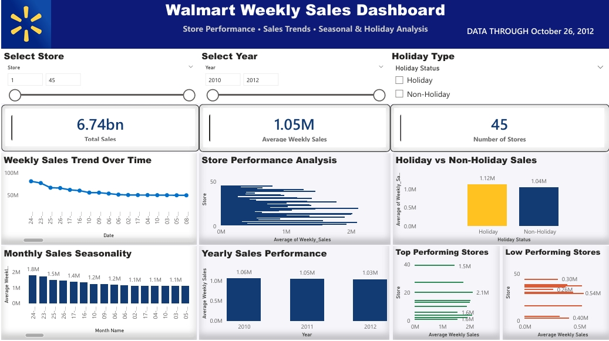

#  Walmart Sales Forecasting

Forecasting Walmart's weekly store sales using Machine Learning, with an interactive prediction app and a Power BI dashboard for retail performance analysis.

**🔗 Live App:** [walmart-sales-forecasting.streamlit.app](https://walmart-sales-forecasting-zh3a24bysrcdsrymzppyiz.streamlit.app/)

---

## Overview

This project covers the full pipeline of a retail sales forecasting solution — from raw data to a deployed, interactive prediction tool. It includes data preprocessing, exploratory data analysis, feature engineering, machine learning model development, a live Streamlit prediction app, and a Power BI dashboard for business insights.

## Features

- Data cleaning and preprocessing
- Exploratory Data Analysis (EDA)
- Feature engineering for sales forecasting
- Machine learning–based weekly sales prediction
- Interactive Streamlit web application
- Power BI dashboard for retail performance analysis

## Machine Learning Model

- **Algorithm:** Random Forest Regressor
- **Training data:** Historical Walmart weekly sales, combined with store, time, and economic indicator features
- **Performance:**

| Metric | Value |
|---|---|
| MAE | $45,153 |
| RMSE | $64,937 |
| R² Score | 0.9852 |

**Top contributing features:** Previous Week Sales, Previous 4-Weeks Sales, and Week of year account for the majority of the model's predictive power.

## Power BI Dashboard

The dashboard provides insights on:

- Store performance analysis
- Weekly sales trends
- Holiday vs. Non-Holiday sales comparison
- Monthly sales seasonality
- Yearly sales performance
- Top and lowest performing stores



## Tech Stack

- **Language:** Python
- **Data & ML:** Pandas, NumPy, Scikit-learn
- **Visualization:** Matplotlib, Seaborn, Power BI
- **App:** Streamlit

## Project Structure

```
Walmart-Sales-Forecasting/
│
├── app.py                 # Streamlit prediction app
├── requirements.txt        # Python dependencies
├── data/                  # Raw and processed datasets
├── model/                 # Trained model (.joblib)
├── images/                # Dashboard screenshots and assets
└── src/
    ├── eda.py              # Exploratory data analysis
    ├── feature_engineering.py
    └── train.py            # Model training script
```

## Getting Started

**1. Clone the repository**
```bash
git clone https://github.com/hammeshkh5446-sudo/Walmart-Sales-Forecasting.git
cd Walmart-Sales-Forecasting
```

**2. Install dependencies**
```bash
pip install -r requirements.txt
```

**3. Run the app**
```bash
streamlit run app.py
```

The app will open in your browser at `http://localhost:8501`.

## Author

**M. Hammad Shahbaz**
